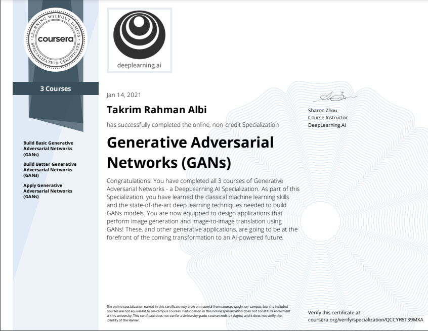

# Generative Adversarial Networks Specialization on Coursera (offered by deeplearning.ai)

Programming assignments from all courses in the Coursera [GAN Specialization](https://www.deeplearning.ai/generative-adversarial-networks-specialization/) offered by `deeplearning.ai`.

## Courses

The GAN Specialization on Coursera contains three courses:

1. [Course 1: Build Basic Generative Adversarial Networks](https://www.coursera.org/learn/build-basic-generative-adversarial-networks-gans)

2. [Course 2: Build Better Generative Adversarial Networks](https://www.coursera.org/learn/build-better-generative-adversarial-networks-gans)

3. [Course 3: Apply Generative Adversarial Networks (GANs)](https://www.coursera.org/learn/apply-generative-adversarial-networks-gans)

## About GANs

- Generative Adversarial Networks (GANs) are powerful machine learning models capable of generating realistic image, video, and voice outputs.

- Rooted in game theory, GANs have wide-spread application: from improving cybersecurity by fighting against adversarial attacks and anonymizing data to preserve privacy to generating state-of-the-art images, colorizing black and white images, increasing image resolution, creating avatars, turning 2D images to 3D, and more.   

- As computing power has increased, so has the popularity of GANs and its capabilities. GANs have opened up many new directions: from generating high amounts of datasets for training machine learning models and allowing for powerful unsupervised learning models to producing sharper, discrete, and more accurate outputs. GANs have also informed research in adjacent areas like adversarial learning, adversarial examples and attacks, model robustness, etc.

## About this Specialization

- The deeplearning.ai [Generative Adversarial Networks (GANs) Specialization](https://bit.ly/3bxUX44) provides an exciting introduction to image generation with GANs, charting a path from foundational concepts to advanced techniques through an easy-to-understand approach. It also covers social implications, including bias in ML and the ways to detect it, privacy preservation, and more.

- Build a comprehensive knowledge base and gain hands-on experience in GANs. Train your own model using PyTorch, use it to create images, and evaluate a variety of advanced GANs.

## Programming Assignments

### Course 1: Build Basic Generative Adversarial Networks (GANs)

- This is the first course of the Generative Adversarial Networks (GANs) Specialization.

#### Week 1: Intro to GANs

- Learn about GANs and their applications, understand the intuition behind the basic components of GANs, and build your very own GAN using PyTorch.
- Assignment:
	- [Your First GAN](https://nbviewer.jupyter.org/github/Alvi-Rahman/GAN-Specialization/blob/master/C1%20-%20Build%20Basic%20Generative%20Adversarial%20Networks%20(GANs)/Week%201/First_GAN_FROM_SCRATCH.ipynb)
	- [Your First GAN](https://nbviewer.jupyter.org/github/Alvi-Rahman/GAN-Specialization/blob/master/C1%20-%20Build%20Basic%20Generative%20Adversarial%20Networks%20(GANs)/Week%201/Inputs_to_a_pre_trained_GAN.ipynb)

#### Week 2: Deep Convolutional GAN

- Build a more sophisticated GAN using convolutional layers. Learn about useful activation functions, batch normalization, and transposed convolutions to tune your GAN architecture and apply them to build an advanced DCGAN specifically for processing images.
- Assignment:
	- [Deep Convolutional GAN (DCGAN)](https://nbviewer.jupyter.org/github/Alvi-Rahman/GAN-Specialization/blob/master/C1%20-%20Build%20Basic%20Generative%20Adversarial%20Networks%20(GANs)/Week%202/DC_GAN.ipynb)
	- [Video Generation](https://nbviewer.jupyter.org/github/Alvi-Rahman/GAN-Specialization/blob/master/C1%20-%20Build%20Basic%20Generative%20Adversarial%20Networks%20(GANs)/Week%202/Video_Generation.ipynb)

#### Week 3: Wasserstein GANs with Normalization

- Reduce instances of GANs failure due to imbalances between the generator and discriminator by learning advanced techniques such as WGANs to mitigate unstable training and mode collapse with a W-Loss and an understanding of Lipschitz Continuity.
- Assignment:
	- [Wasserstein GAN with Gradient Penalty (WGAN-GP)](https://nbviewer.jupyter.org/github/Alvi-Rahman/GAN-Specialization/blob/master/C1%20-%20Build%20Basic%20Generative%20Adversarial%20Networks%20(GANs)/Week%203/WGAN_GP.ipynb)
	- [SN-GAN](https://nbviewer.jupyter.org/github/Alvi-Rahman/GAN-Specialization/blob/master/C1%20-%20Build%20Basic%20Generative%20Adversarial%20Networks%20(GANs)/Week%203/SNGAN.ipynb)
	- [Info-GAN](https://nbviewer.jupyter.org/github/Alvi-Rahman/GAN-Specialization/blob/master/C1%20-%20Build%20Basic%20Generative%20Adversarial%20Networks%20(GANs)/Week%203/InfoGAN.ipynb)
	- [Info-GAN](https://nbviewer.jupyter.org/github/Alvi-Rahman/GAN-Specialization/blob/master/C1%20-%20Build%20Basic%20Generative%20Adversarial%20Networks%20(GANs)/Week%203/ProteinGAN.ipynb)

#### Week 4: Conditional and Controllable GANs

- Understand how to effectively control your GAN, modify the features in a generated image, and build conditional GANs capable of generating examples from determined categories.
- Assignments:
	- [Build a Conditional GAN](https://nbviewer.jupyter.org/github/Alvi-Rahman/GAN-Specialization/blob/master/C1%20-%20Build%20Basic%20Generative%20Adversarial%20Networks%20(GANs)/Week%204/Build_a_Conditional_GAN.ipynb)
	- [Controllable Generation](https://nbviewer.jupyter.org/github/Alvi-Rahman/GAN-Specialization/blob/master/C1%20-%20Build%20Basic%20Generative%20Adversarial%20Networks%20(GANs)/Week%204/Controllable_Generation.ipynb)

---

### Course 2: Build Better Generative Adversarial Networks (GANs)

- This is the second course of the Generative Adversarial Networks (GANs) Specialization.

#### Week 1: GAN Evaluation

- Understand the challenges of evaluating GANs, learn about the advantages and disadvantages of different GAN performance measures, and implement the Fréchet Inception Distance (FID) method using embeddings to assess the accuracy of GANs.
- Assignment:
	- [Evaluating GANs / Fréchet Inception Distance](https://nbviewer.jupyter.org/github/Alvi-Rahman/GAN-Specialization/blob/master/C2%20-%20Build%20Better%20Generative%20Adversarial%20Networks%20(GANs)/Week%201/Evaluating%20GANs%20%20Fr%C3%A9chet%20Inception%20Distance.ipynb)

#### Week 2: GAN Disadvantages and Bias

- Find out the disadvantages of GANs when compared to other generative models, discover the pros/cons of these models — plus, learn about the many places where bias in machine learning can come from, why it’s important, and an approach to identify it in GANs.
- Assignments:
	- [Variational Autoencoder (VAE)](https://nbviewer.jupyter.org/github/Alvi-Rahman/GAN-Specialization/blob/master/C2%20-%20Build%20Better%20Generative%20Adversarial%20Networks%20(GANs)/Week%202/VAE.ipynb)

#### Week 3: StyleGAN and Advancements

- Understand how StyleGAN improves upon previous models and implement the components and the techniques associated with StyleGAN, currently the most state-of-the-art GAN with powerful capabilities
- Assignment:
	- [Components of StyleGAN](https://nbviewer.jupyter.org/github/Alvi-Rahman/GAN-Specialization/blob/master/C2%20-%20Build%20Better%20Generative%20Adversarial%20Networks%20(GANs)/Week%203/Components%20of%20StyleGAN.ipynb)
	- [Components of BigGAN](https://nbviewer.jupyter.org/github/Alvi-Rahman/GAN-Specialization/blob/master/C2%20-%20Build%20Better%20Generative%20Adversarial%20Networks%20(GANs)/Week%203/BigGAN.ipynb)
	- [StyleGAN2](https://nbviewer.jupyter.org/github/Alvi-Rahman/GAN-Specialization/blob/master/C2%20-%20Build%20Better%20Generative%20Adversarial%20Networks%20(GANs)/Week%203/StyleGAN2.ipynb)

---

### Course 3: Apply Generative Adversarial Networks (GANs)

- This is the third course in the Generative Adversarial Networks (GANs) Specialization.

#### Week 1: GANs for Data Augmentation and Privacy Preservation

- Explore the applications of GANs and examine them w.r.t. data augmentation, privacy, and anonymity.
- Improve your downstream AI models with GAN-generated data.
- Assignment:
	- [Data Augmentation](https://nbviewer.jupyter.org/github/Alvi-Rahman/GAN-Specialization/blob/master/C3%20-%20Apply%20Generative%20Adversarial%20Networks%20(GANs)/C3W1/Data%20Augmentation.ipynb)
	- [Generative Teaching Networks](https://nbviewer.jupyter.org/github/Alvi-Rahman/GAN-Specialization/blob/master/C3%20-%20Apply%20Generative%20Adversarial%20Networks%20(GANs)/C3W1/Generative_Teaching_Networks.ipynb)

#### Week 2: Image-to-Image Translation

- Leverage the image-to-image translation framework and identify extensions, generalizations, and applications of this framework to modalities beyond images.
- Implement Pix2Pix, a paired image-to-image translation GAN, to adapt satellite images to map routes (and vice versa) with advanced U-Net generator and PatchGAN discriminator architectures.
- Assignments:
	- [U-Net](https://nbviewer.jupyter.org/github/Alvi-Rahman/GAN-Specialization/blob/master/C3%20-%20Apply%20Generative%20Adversarial%20Networks%20(GANs)/C3W2/U-NET.ipynb)
	- [Pix2Pix](https://nbviewer.jupyter.org/github/Alvi-Rahman/GAN-Specialization/blob/master/C3%20-%20Apply%20Generative%20Adversarial%20Networks%20(GANs)/C3W2/PIX2PIX_GAN.ipynb)

#### Week 3: Image-to-Image Unpaired Translation

- Compare paired image-to-image translation to unpaired image-to-image translation and identify how their key difference necessitates different GAN architectures.
- Implement CycleGAN, an unpaired image-to-image translation model, to adapt horses to zebras (and vice versa) with two GANs in one.
- Assignment:
	- [CycleGAN](https://nbviewer.jupyter.org/github/Alvi-Rahman/GAN-Specialization/blob/master/C3%20-%20Apply%20Generative%20Adversarial%20Networks%20(GANs)/C3W3/Cycle_GAN.ipynb)

---
# Specialization Completion Certificate

